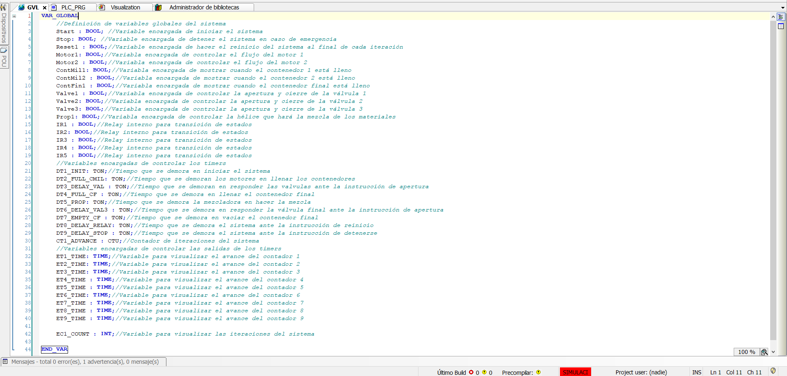
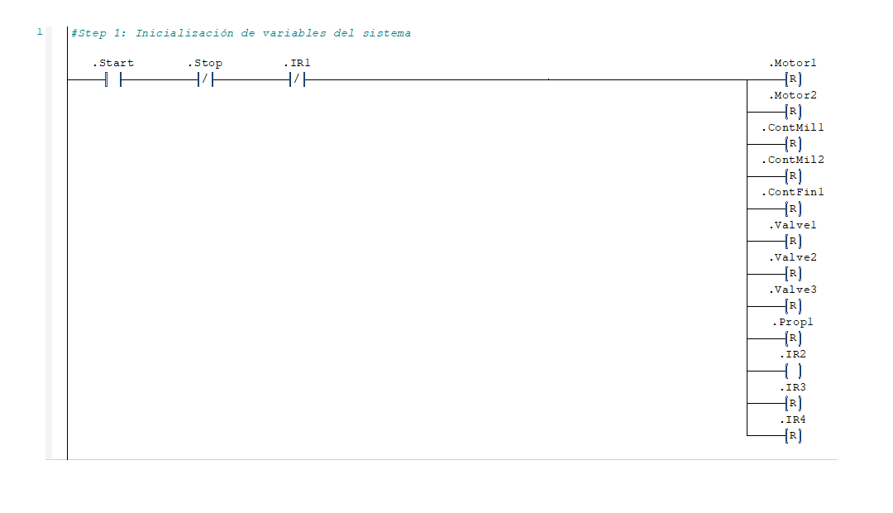
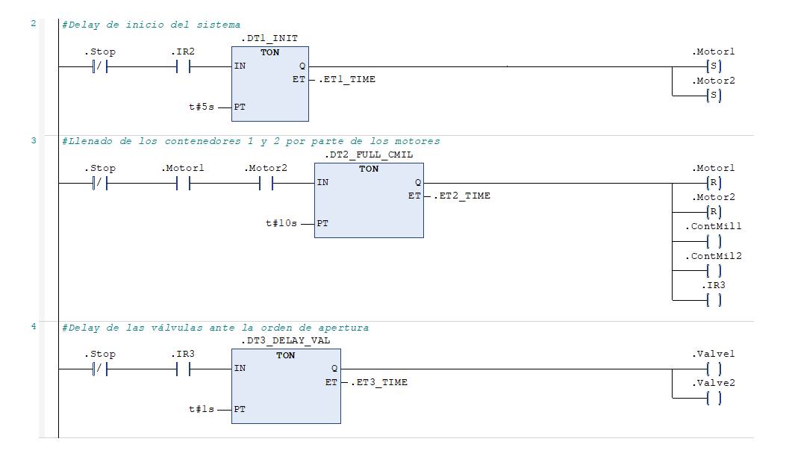
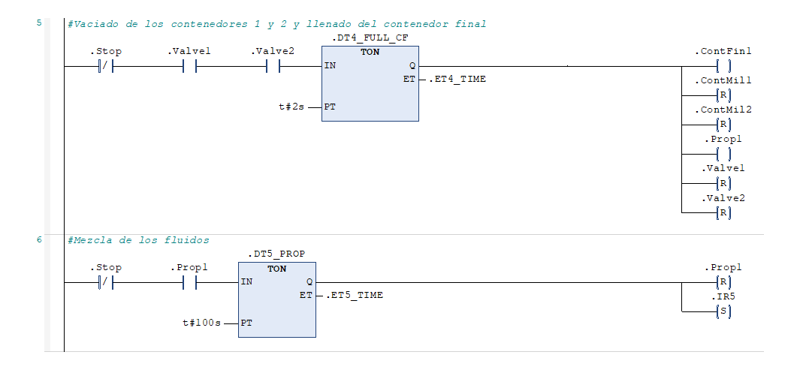
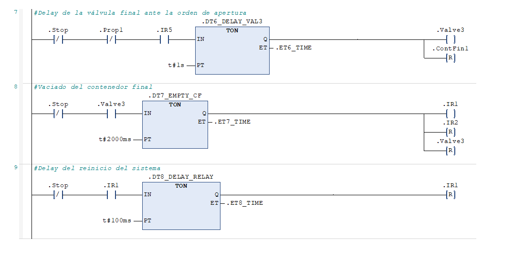
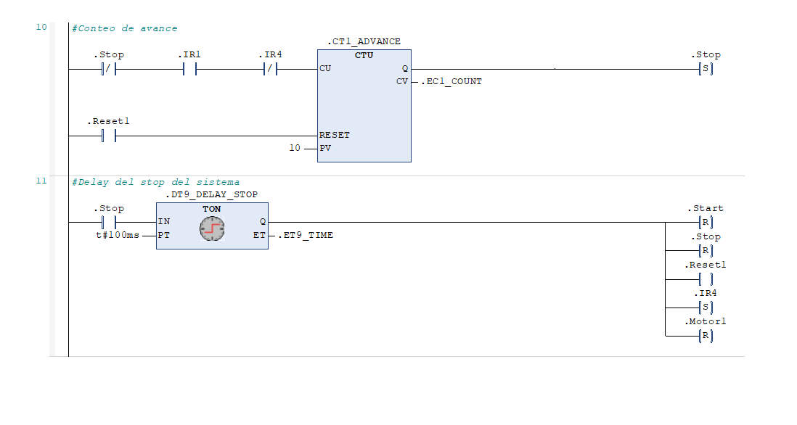
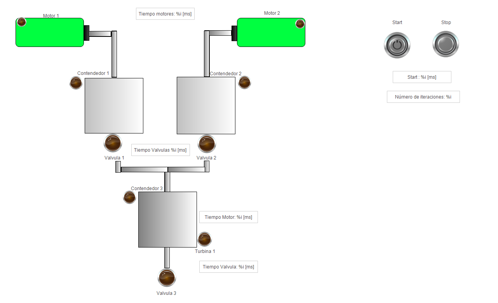
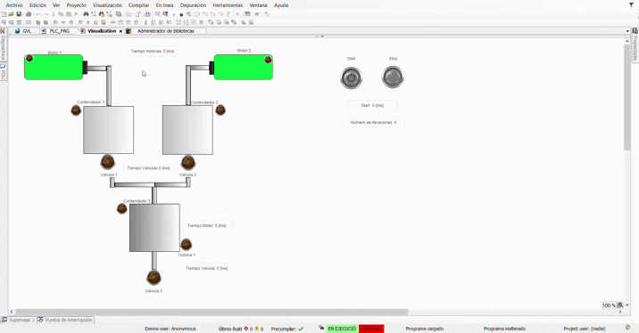

# Automatización Liquidos 1A S.A.

## Contenido
  - [Diseño](#diseño)
  - [Implementación en OpenPLC](#implementación-en-openplc)
  - [Implementación en Arduino](#implementación-en-arduino)
  - [Implementación en Codesys](#implementación-en-codesys)
  - [Implementación de HMI](#implementación-de-hmi)

## Diseño
Para la automatización del proceso dentro de la planta se analizó el sistema teniendo en cuenta las condiciones iniciales y el proceso en diferentes estados, planteando el sistema en la imagen 1.

Dentro de la imagen en la parte superior derecha se definió los componentes del programa necesarios y sus estados posibles. También, en la parte media izquierda, se planteó el uso de una escala de $\frac{1}{10}$ para los verdaderos valores de los tiempos y flujos en la planta, y para la simulación en Codesys y OpenPLC una escala de 1, lo que implica que si en las simulaciones hay un flujo de 100 litros por segundo el flujo de la planta sería de 10 litros/segundo.

Para el planteamiento del proceso en la planta se propuso que la salida para las motobombas fuera de 10 litros/segundo, el encendido de estas bombas se realiza al mismo tiempo con el fin de sincronizar las dos ramas del proceso y reducir la complejidad, esta salida se usó como base para definir los otros parametros de la planta, por lo tanto, el tiempo de llenado de los dos tanques es de 100 segundos (en 10 segundos 100 litros, 10 veces 10 segundos 1000 litros), luego debido a que las valvulas de los dos tanques de 1000 litros se deben abrir simultaneamente se opta por un flujo de 20 litros por segundo en las dos valvulas, por lo que después de abiertas el contenedor de 2000 litros se llena en 50 segundos (40 litros/segundo en 5 segundos 200 litros, en 50 segundos 2000 litros), al llenarse el contenedor de 2000 litros se inicia el rotor de la mezcladora por 100 segundos, seguidamente se abre la valvula de este contenedor que tiene también un flujo de 20 litros por segundo lo que permite unificar la salida de los 3 contenedores, por lo que el contenedor tarda en desocuparse 100 segundos, (100 litros en 5 segundos, 1000 litros en 50 segundos, 2000 litros en 100 segundos) después de estos 100 segundos el sistema reinicia el proceso y se repite 10 veces porque en cada iteración se mezclan 2000 litros de detergente.

El tiempo del proceso se acumula desde el inicio de las motobombas primero 100 segundos para llenar los dos contenedores de 1000 litros, luego 50 segundos para el llenado del contenedor de 2000 litros, seguidamente el rotor de la mezcladora que dura 100 segundos y por último se desocupa el contenedor de 2000 litros en un lapso de 100 segundos, por lo que el tiempo final del proceso alcanza los 350 segundos.

## Implementación en Codesys
Para la implementación en Codesys, primero se definieron las variables globales del sistema

Posterior a la definición de variables, se procedió al diseño dentro del editor de Codesys

## Implementación de HMI
Para la implementación del HMI, se usó la herramienta de visualización de Codesys, con la cual se logró el siguiente diseño:

El cual puesto en marcha se ve de la siguienta forma:

## Implementación en OpenPLC

Para la implementación en OpenPLC se plantearon las siguientes variables 

Se implementó el diseño en el editor de OpenPLC:

## Implementación en Arduino

Para la implementación en Arduino se hizo uso de las 4 salidas digitales que puede utilizar el firmware de OpenPLC 

Esto se implementó en físico teniendo en cuenta el siguiente diagrama: 

